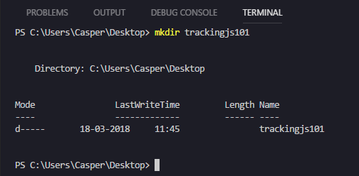

# Face Recognition with TrackingJS

## Prerequisites
* Visual Studio Code - https://code.visualstudio.com/

## Purpose
Build your own snapchat filters with TrackingJS face recognition

> Based on http://www.instructables.com/id/Facial-Recognition-With-Trackingjs/

## What is face recognition?


Have you ever thought about how you recognize faces?
* Eye color and shape
* Hair color and hair cut
* Nose style and size
* Chin

> People can suffer from a neurological condition called Prognosia - Face blindness

Your computer uses an advanced form of pattern matching for identifying faces in pictures.

If you want to you can train your computer to identify almost any object.

Can you think about other forms of image recognition?

* [Racoon detector](https://towardsdatascience.com/how-to-train-your-own-object-detector-with-tensorflows-object-detector-api-bec72ecfe1d9)
* [BroBizz PaybyPlate](https://brobizz.com/dk/snart-kan-du-betale-med-din-nummerplade-pa-storebaelt)

* [Yandex Translate](https://translate.yandex.com/ocr)

* [Google Lens](https://www.youtube.com/watch?v=igTtOA1jcik)

## TrackingJS
We'll be using the javascript library - TrackingJS for adding Face Recognition to a web page.

The library allow you to recognize colors and faces in photos and video.

You can start by checking out the cool demos on their web page:
* https://trackingjs.com/

## Get started



1. First thing we need to do is to create a folder for our project, e.g. "TrackingJs101"


2. Open the VS Code "Command Palette", type "open folder", and select the command named "File: Open Folder..."


3. Select the folder you created in step 1, and it will be visible in VS Code's left pane.

4. Last thing before we start coding, is setting up a local "[Caddy](https://caddyserver.com/)" web server.


5. Go to the Caddy site - https://caddyserver.com/, and click the "Free download" link.


6. Change the "License" to "Personal", and download Caddy


7. Extract the Caddy.exe file to your folder


8. Create a new file named ```caddyfile``` (without any file extension)

9. 
 
8. Create a new file named ```snap.htm```

```
<!doctype html>
<html>
    <head>
        <meta charset="utf-8">
        <title>Snap</title>
        <style>
            video,
            canvas {
                margin-left: 230px;
                margin-top: 120px;
                position: absolute;
            }
        </style>
    </head>
    <body>
    </body>
</html>
```

9. Start by adding a basic HTML page structure - ```html```, ```head```, and ```body``` tags.

10. Then add a link / reference to TrackingJS Javascript library


4. Go to https://cdnjs.com/libraries/tracking.js, and add ```<script src=""></script>``` tags for the following:
    * https://cdnjs.cloudflare.com/ajax/libs/tracking.js/1.1.3/tracking.js
    * https://cdnjs.cloudflare.com/ajax/libs/tracking.js/1.1.3/data/eye.js
    * https://cdnjs.cloudflare.com/ajax/libs/tracking.js/1.1.3/data/face.js
    * https://cdnjs.cloudflare.com/ajax/libs/tracking.js/1.1.3/data/mouth.js

```
    <script src="https://cdnjs.cloudflare.com/ajax/libs/tracking.js/1.1.3/tracking.js"></script>
    <script src="https://cdnjs.cloudflare.com/ajax/libs/tracking.js/1.1.3/data/eye.js"></script>
    <script src="https://cdnjs.cloudflare.com/ajax/libs/tracking.js/1.1.3/data/face.js"></script>
    <script src="https://cdnjs.cloudflare.com/ajax/libs/tracking.js/1.1.3/data/mouth.js"></script>
```

5. Your ```<head>``` section after adding the TrackingJS links

```
<div class="demo-frame">
    <div class="demo-container">
        <video id="video" width="320" height="240" preload autoplay loop muted></video>
        <canvas id="canvas" width="320" height="240"></canvas>
    </div>
</div>
```
6. Add two ```<div>``` containers for a ```<video>``` and ```<canvas>``` element.